# Active Directory & Help Desk Automation Lab
### Enterprise Infrastructure & User Lifecycle Management

This project demonstrates the end-to-end deployment of a Windows-based enterprise environment. It covers the installation of a Domain Controller, automated user provisioning via PowerShell, and the integration of client workstations into a secure virtual network.

## 🛠️ Technologies Used
* **Hypervisor:** VirtualBox
* **Operating Systems:** Windows Server 2022, Windows 10 Pro
* **Scripting:** PowerShell (Automation & Bulk Provisioning)
* **Directory Services:** Active Directory Domain Services (AD DS)
* **Networking:** Static IP Addressing, DNS Configuration, ICMP Verification

---

## 📸 Project Milestones & Documentation

### Phase 1: Server Provisioning & Network Baseline

#### 01. Provisioning Verification
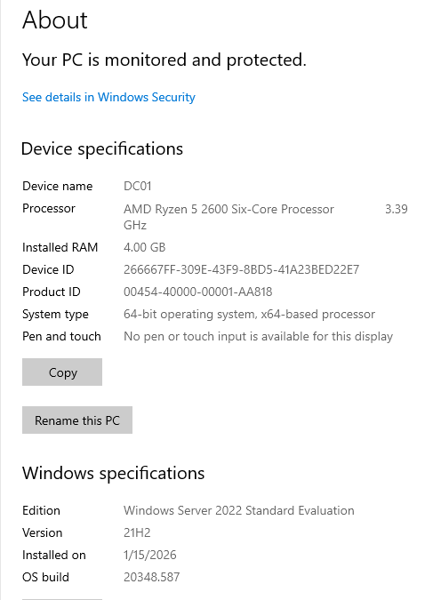
Successfully provisioned Windows Server 2022 Standard (Desktop Experience). Validated system specifications (4GB RAM, 2 vCPUs) and updated the hostname to 'DC01' to align with enterprise asset management standards. This unified view confirms the baseline environment is ready for Active Directory Domain Services (AD DS) promotion.

#### 02. Static IP Configuration
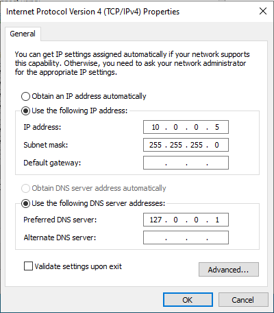
Assigned a static IPv4 address (10.0.0.5) to the Domain Controller. This IP scheme ensures the primary identity server is logically separated from the workstation (10.0.0.10) and security testing (10.0.0.20) nodes, facilitating organized traffic monitoring and firewall rule management.

---

### Phase 2: Domain Services Deployment

#### 03. AD DS Role Installation
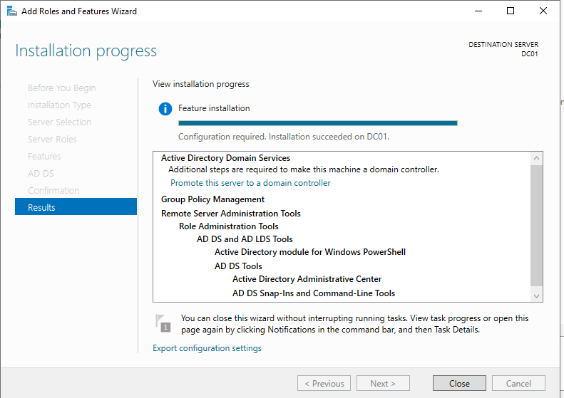
Commenced the installation of the Active Directory Domain Services (AD DS) role. This core component serves as the foundation for the domain's hierarchical structure, enabling centralized authentication and the deployment of Group Policy Objects (GPOs).

#### 04. NetBIOS Configuration
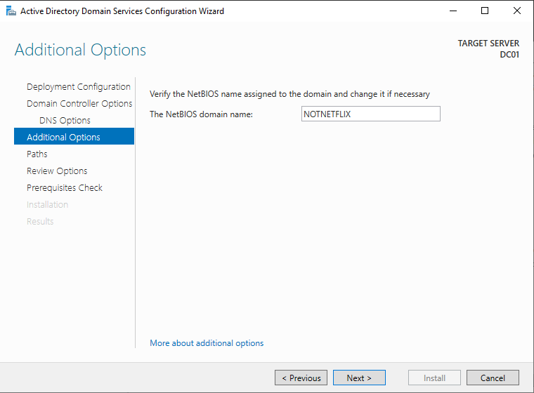
Confirmed the NetBIOS domain name as 'NOTNETFLIX'. This ensures legacy compatibility and provides a flat-name identifier for the domain, which is essential for user login formatting and internal network identification.

#### 05. Domain Admin Authentication
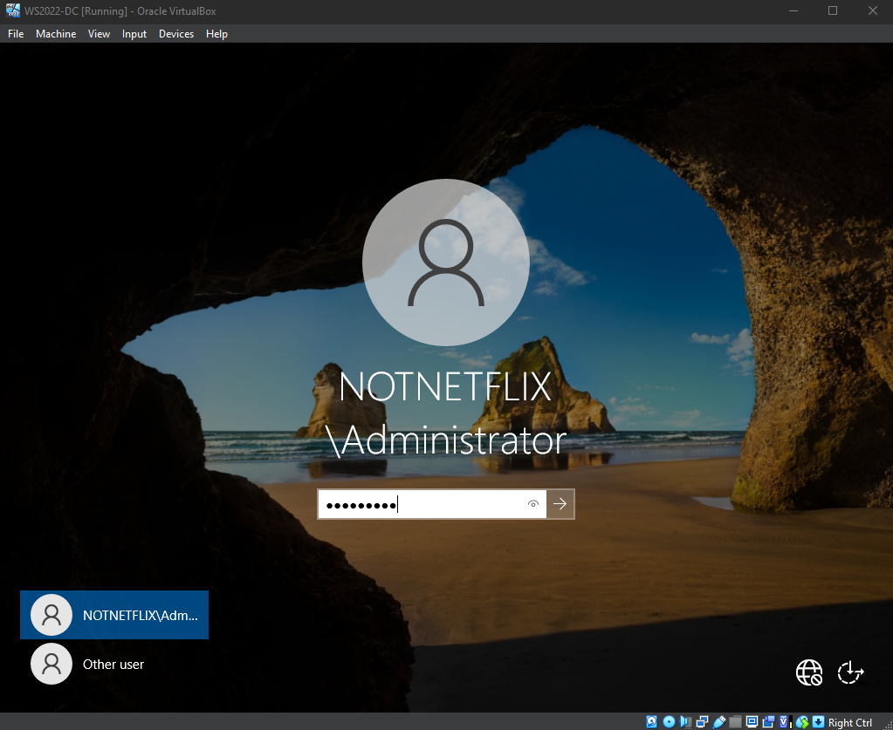
Verified successful forest creation by authenticating as the Domain Administrator (NOTNETFLIX\Administrator). This confirms the transition from a standalone local server to a centralized Directory Services environment.

---

### Phase 3: Directory Architecture & Automation

#### 06. OU Structure Design
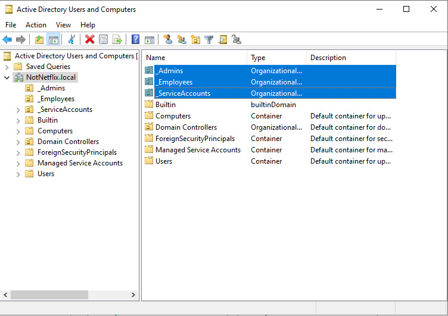
Established a logical Organizational Unit (OU) structure to mirror corporate departments. This hierarchy allows for granular Group Policy application and delegated administrative control, a core competency for Help Desk and System Administration roles.

#### 07. PowerShell Automation Script
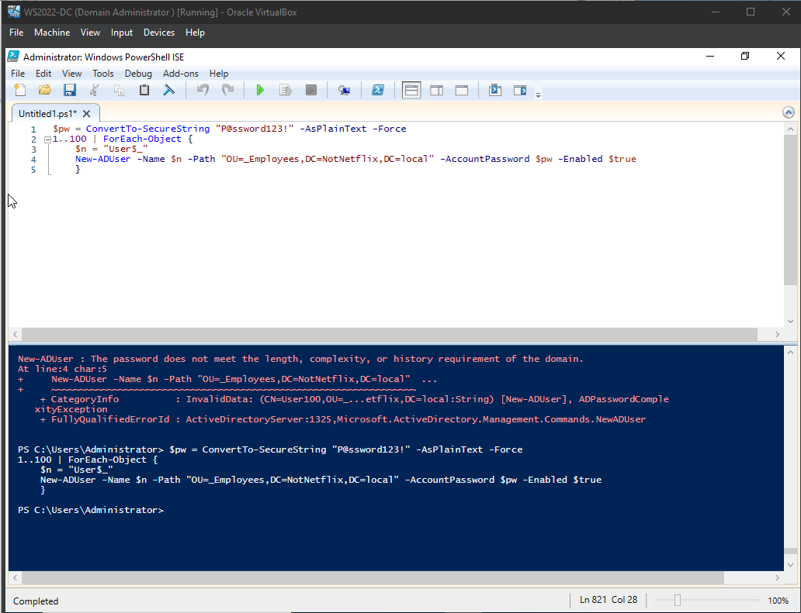
Developed a concise PowerShell loop to automate the creation of 100 Active Directory user objects. This demonstrates the ability to use CLI tools to perform bulk administrative tasks efficiently, a key skill for enterprise Help Desk environments.

#### 08. Bulk Provisioning Success
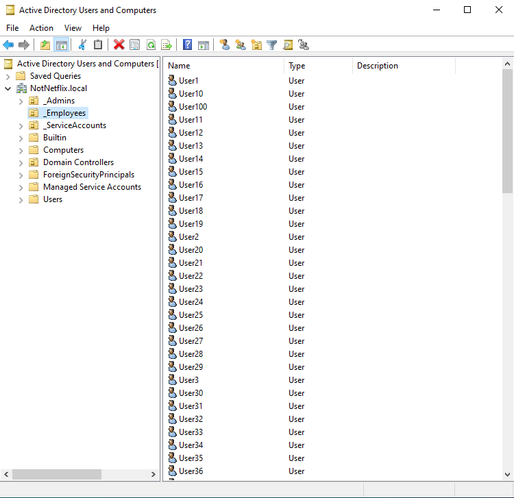
Confirmed successful script execution by verifying the injection of 100 user objects into the '_Employees' OU within the ADUC console. This side-by-side validation ensures database integrity post-automation.

---

### Phase 4: Client Integration & Connectivity

#### 09. DNS & Connectivity Verification
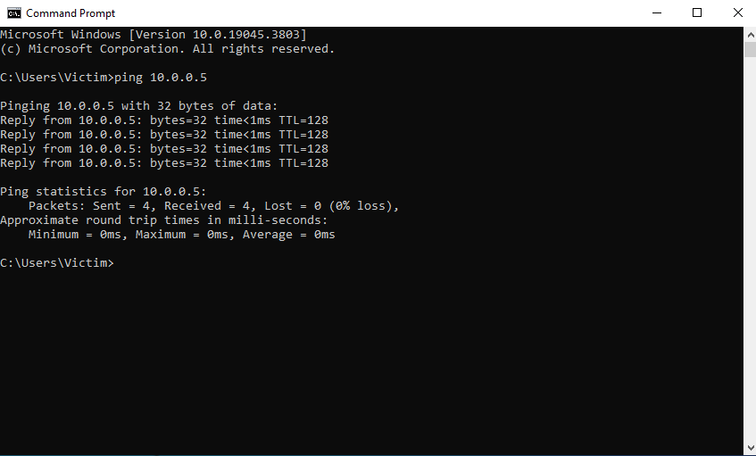
Verified end-to-end connectivity between the Windows 10 client and the Domain Controller. Successful ICMP 'ping' replies from NotNetflix.local confirm that DNS resolution is functioning correctly, a vital step before attempting a domain join.

#### 10. Domain Join Success
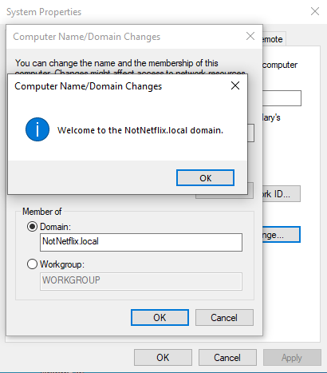
Successfully integrated the Windows 10 workstation into the NotNetflix.local domain. This milestone enables centralized user authentication and confirms the Domain Controller is actively managing client assets.

---

### Phase 5: Help Desk Operations & Testing

#### 11. Domain User Login
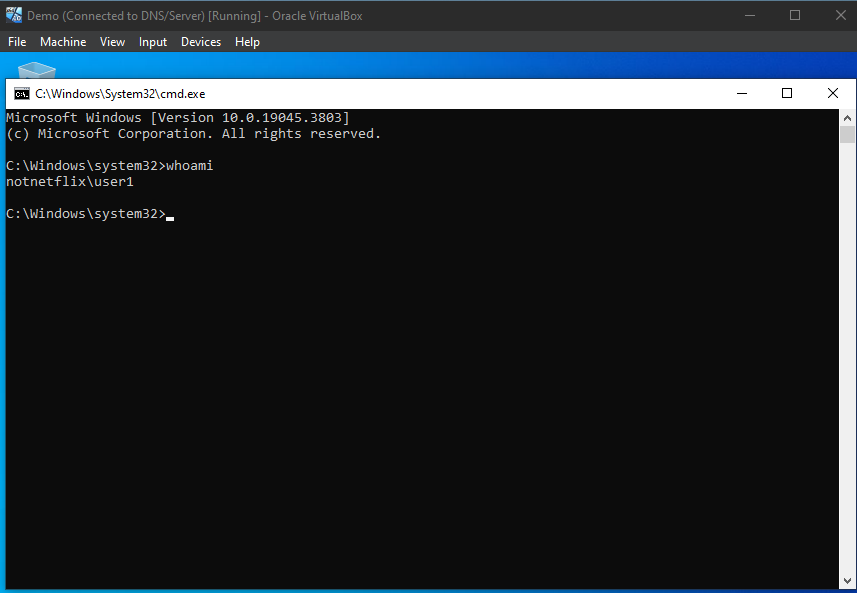
Validated the end-to-end account provisioning process by successfully logging into the workstation using a PowerShell-created account (User1). This confirms the global availability of directory objects across the network.

#### 12. Ticket Simulation: Password Reset
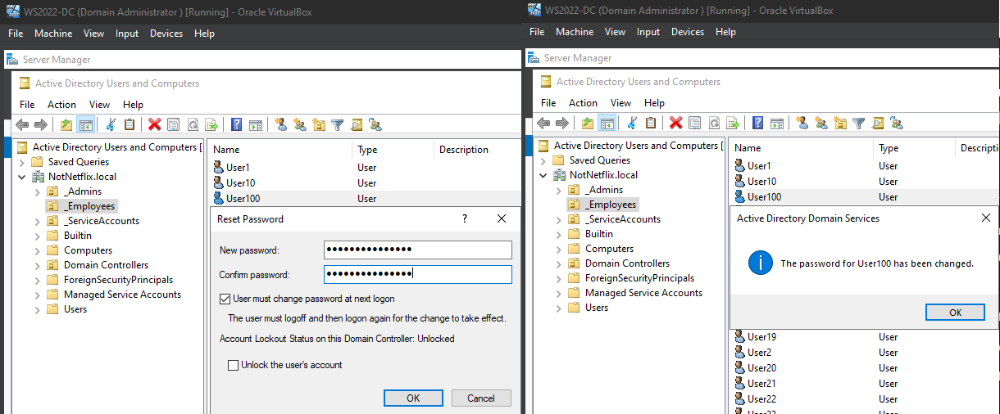
Simulated a standard Help Desk support ticket by performing a secure password reset for 'User100'. Configured the 'Force Password Change' flag to ensure the end-user establishes a private credential upon their next successful authentication, adhering to NIST password security standards.
